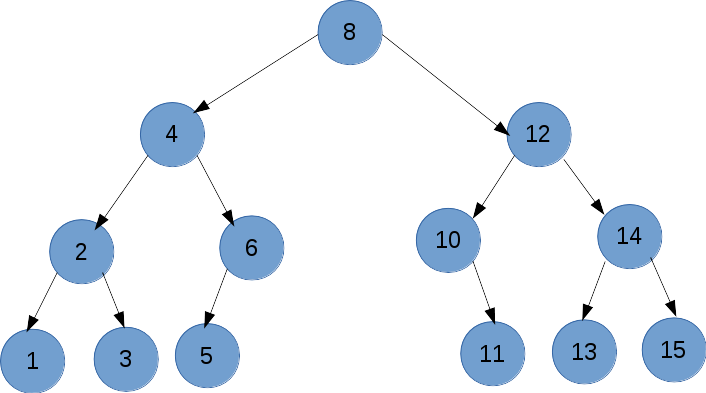

<h1 align="center">
  
</h1>

## 💻 Projeto

Todas as implementações da disciplina de Estrutura de dados avançada.

### 💥 Teste você mesmo!

Em cada pasta terá um Readme com os comandos para teste.

 
