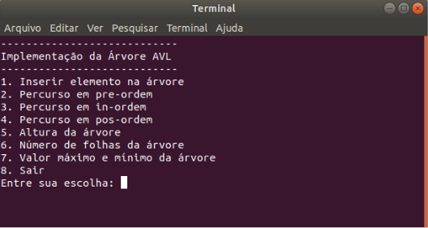

## QXD0115 – EDA Trabalho Semanal 02 | 22/07/2020

```
Universidade Federal do Ceará - Campus Quixadá
QXD0115 – Estrutura de dados avan ̧cada – Turma 01A
Curso de Ciência da Computação
Prof. Atílio Gomes Luiz
```

```
Trabalho Semanal 02 –Arvores AVL
```

1. (10 points) A árvore AVL é uma árvore binária de busca balanceada, ou seja, uma
   árvore binária de busca que minimiza o número de comparações efetuadas no pior
   caso para uma busca com chaves de probabilidades de ocorrências idênticas.
   Em aplicações dinâmicas, para garantir que a árvore sempre mantenha essa pro-
   priedade de ser balanceada, é preciso reconstruir a árvore para seu estado ideal a
   cada operação sobre seus nós (inclusão ou exclusão), para ser alcançado um custo de
   algoritmo com o tempo de pesquisa tendendo à O(logn).
   A Arvore AVL foi criada em 1962 pelos soviéticos Adelson Velsky e Landis que á
   criaram para que fosse possível inserir, buscar e remover um elemento em tempo
   O(logn), onde o número de elementos contidos na árvore. Tal estrutura foi a
   primeira árvore binária balanceada criada.
   Uma árvore binária T é denominada AVL quando, para qualquer nó de T, as alturas
   de suas duas sub árvores, esquerda e direita, diferem em módulo de até uma unidade.
   Pela definição, fica estabelecido que todo nó de uma árvore AVL deve respeitar a
   seguinte propriedade:
   - |hd(u) − he(u)| ≤ 1, onde hd(u) é a altura da subárvore direita do nó u e he(u)
     é a altura da subárvore esquerda do nó u.

```
O valor hd(u) − he(u) é denominado fator de balanço do nó. Quando um nó possui
fator de balanço com valor -1, 0 ou 1 então o mesmo é um nó regulado. Todos os nós
de uma árvore AVL são regulados, caso contrário a árvore não é AVL.
```

```
Descrição do trabalho:

O trabalho consiste em implementar uma árvore AVL na
linguagem C++. A sua implementação deve possibilitar ao usuário final, realizar as
seguintes operações:
```

```
(a) inserir um elemento (nó) na árvore. Observação: Um elemento consiste em
um par (chave, valor), onde chave e valor devem ser do tipo std::string

(b) apagar todos os nós da árvore.

(c) percurso em pre-ordem

(d) percurso em ordem simétrica (percurso em ordem)

(e) percurso em pós-ordem

(f) pesquisar uma chave e retornar o valor associado à chave caso ela exista na
árvore.

(g) calcular a altura da árvore
```

- <b>Consideração 1: </b>Lembre que a árvore AVL é uma árvore binária de busca
  <b>balanceada</b>. Logo, a operação de inclusão deve garantir que a árvore resultante
  continue AVL após a inclusão de um elemento. Lembre também que a inclusão
  deve ser realizada em O(log n). A teoria de como fazer inserções em árvores AVL
  e até mesmo o algoritmo de inser

- <b>Consideração 2:</b> Uma outra fonte que você pode consultar é o Capı́tulo 5
  (Árvores Balanceadas) do livro Estruturas de Dados e seus algoritmos, dos au-
  tores Jayme Luiz Szwarcfiter e Lilian Markenzon (o link para este livro está na
  nossa página do Moodle).

- <b>Consideração 3:</b> A teoria e os algoritmos para as demais operações, tais como
  os percursos, foram vistas em sala de aula ou foram deixadas como exercı́cio
  para casa.

- <b>Consideração 4:</b> Teste o seu programa para diversos valores e ordem de chaves
  e verifique se a árvore que ele constrói é realmente uma árvore AVL. Para testar,
  basicamente, você pode usar os percursos para imprimir a sua árvore na tela
  e verificar se ela está balanceada. Você também pode consultar a altura da
  árvore. Esses parâmetros te darão uma ideia se você codificou algo errado e
  se precisa voltar na sua implementação ou na teoria para ver o que você errou.
  Como um exemplo, se você entrar as chaves 1,2,3,4,5,6,7,8 nesta ordem, a árvore
  produzida deve ter altura 4, deve ter 4 folhas e o percurso em pre-ordem deve
  imprimir as chaves nesta ordem: 4,2,1,3,6,5,7,8. Para efeito de teste, além de
  imprimir a chave do nó, imprima também o balanço do nó para ter uma ideia
  do balanceamento dos nós.

- <b>Consideração 5:</b> Você também pode usar a ferramenta de visualização de
  estruturas de dados chamada Visualgo para comparação e testar se seus resul-
  tados estão corretos. Essa ferramenta está disponı́vel na internet nesse link:
  https://visualgo.net. Ela possui uma implementação da árvore AVL aqui:
  https://visualgo.net/en/bst

- <b>Consideração 6:</b> O seu programa deve apresentar um menu como interface
  para o usuário com todas as operações listadas acima. Um exemplo de menu é
  apresentado na Figura 1. Adapte esse menu de acordo com as opções que foram
  pedidas acima.

- <b>Consideração 7:</b> Não esqueça de comentar o seu código.

- <b>Data de entrega do trabalho:</b> Este trabalho deve ser entregue até a meia-
  noite do dia 29/07/2020 (quarta-feira) via Moodle.

<br />
<br />
<br />

<h1 align="center">
  
</h1>

```
Figura 1: Um exemplo de menu para o programa que implementa ́arvore AVL.
```

<br />

## 💥 Teste você mesmo

Para compilar no terminal do Linux:
g++ -Wall avl.cpp main.cpp -o main

Para executar:
./main
